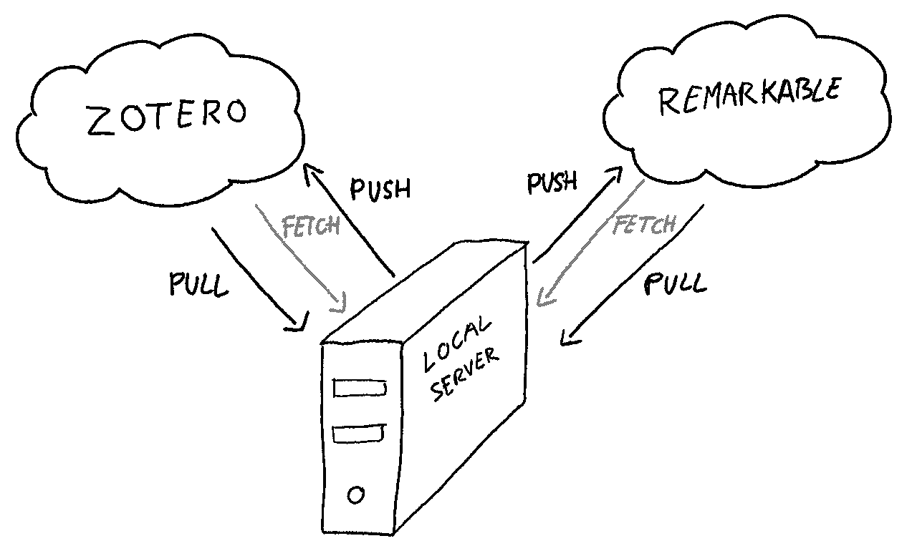

# zotero - reMarkable Synchronization

Synchronize all the .pdf files in your [Zotero](https://www.zotero.org) library with your [reMarkable](https://remarkable.com) device.



##### How does it work?

1. Fetch files from Zotero
2. Fetch files from reMarkable
3. Compare with the last sync files stored in `~/.zot_rm_sync/<dir-name>`
4. Pull changes from Zotero (add new files and remove deleted files)
5. Push changes to reMarkable (add new files and remove deleted files)
6. Pull changes from reMarkable (remove deleted files)
7. Push changes to Zotero (remove deleted files)

Note:
- New files are expected to be added to Zotero only. Files added manually to the reMarkable `/<dir-name>` directory will be ignored.
- reMarkable annotations are not saved in Zotero


## Requirements
Tested on Python 3.6

``` bash
pip install -r requirements.txt
```

## Authorization
### reMarkable

Get a [**Security Code**](https://my.remarkable.com/connect/remarkable) and run ***authorize_rmapy.py***

``` bash
python authorize_rmapy.py --security-code <security-code>
```

### Zotero

Get your [**Zotero Library ID** and **Zotero API Key**](https://www.zotero.org/settings/keys)


## Use

``` bash
python sync.py --zot-library-id/-l <zot-library-id> --zot-api-key/-k <zot-api-key> --directory/-d <dir-name> [--verbose/-v]
```

## Features
- [x] Download .pdf files from the Zotero Library
- [x] Upload .pdf files to reMarkable
- [x] Maintain directory structure
- [x] Prevent duplicate uploads and downloads
- [x] Delete files from reMarkable if they are deleted in the Zotero library
- [ ] Support more file extensions like .epub
- [ ] Update files in Zotero Library with reMarkable annotations


##### Thanks to @urschrei and @subutux for the fantastic APIs  
- https://github.com/urschrei/pyzotero
- https://github.com/subutux/rmapy
